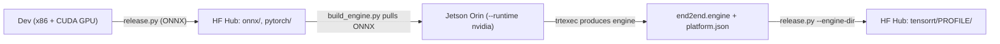

# Deployment guide

This document covers how to export trained models to ONNX and known issues
encountered in the process.

See [mlops.md](mlops.md) for the end-to-end MLOps workflow (train → deploy →
release).

---

## Quick reference

```bash
# Generic segmentation model (DeepLabV3+, etc.)
python tools/deploy/deploy.py \
  configs/deploy/custom/segmentation_onnxruntime_dynamic.py \
  <model_cfg.py> <checkpoint.pth> <sample_image.jpg> \
  --work-dir <output_dir>

# Mask2Former  ← use the dedicated deploy config (see §2 below)
python tools/deploy/deploy.py \
  configs/deploy/custom/segmentation_onnxruntime_dynamic_mask2former.py \
  <model_cfg.py> <checkpoint.pth> <sample_image.jpg> \
  --work-dir <output_dir>
```

---

## Deploy configs

| Config file | Use for |
|---|---|
| `segmentation_onnxruntime_dynamic.py` | Generic mmseg models (DeepLabV3+, SegFormer, …) |
| `segmentation_onnxruntime_static-1024x544.py` | Any model, fixed 1024×544 input |
| `segmentation_onnxruntime_dynamic_mask2former.py` | **Mask2Former** (loads a custom tracer fix, see §2) |

---

## Known issues

### 1 — `RuntimeError: NYI: Named tensors are not supported with the tracer`

**Affects:** Mask2Former (mmseg) exported with a *dynamic-shape* deploy config
via mmdeploy.

**Symptom**

```
RuntimeError: NYI: Named tensors are not supported with the tracer
```

Full call stack (condensed):

```
torch.onnx.export
  → mmdeploy encoder_decoder__predict          # mmdeploy rewriter
  → mmseg Mask2FormerHead.predict (line 146)
      batch_data_samples = [
          SegDataSample(metainfo=metainfo)      # ← crashes here
          for metainfo in batch_img_metas
      ]
  → BaseDataElement.set_metainfo
  → copy.deepcopy(metainfo_dict)
  → Tensor.__deepcopy__ → storage.clone()
  → RuntimeError
```

**Root cause**

mmdeploy's `encoder_decoder__predict` rewriter passes `batch_img_metas` as
plain Python dicts to the decode head.  Under *dynamic-shape* export the
values in those dicts (e.g. `img_shape`) are **traced `torch.Tensor`
objects**, not plain integers.

`Mask2FormerHead.predict` reconstructs `SegDataSample` objects by calling
`SegDataSample(metainfo=metainfo)`.  The constructor calls
`set_metainfo(metainfo)` which does `copy.deepcopy(metainfo)`.
`deepcopy` on a Tensor calls `storage.clone()`, which the JIT tracer cannot
handle, raising the error above.

mmdeploy's own `copy__default` rewriter intercepts `deepcopy(tensor)` at
the **top level**, but misses tensors **nested inside a dict**, so the
`deepcopy(metainfo_dict)` path is not guarded.

> The same underlying issue exists in mmdet's MaskFormer, where mmdeploy's
> own rewriter carries the comment:
> *"note that we can not use `set_metainfo`, deepcopy would crash the onnx
> trace"* (`mmdeploy/codebase/mmdet/models/detectors/maskformer.py`).

**Fix**

A custom `FUNCTION_REWRITER` for `Mask2FormerHead.predict` builds the
`SegDataSample` objects using `set_field` instead of `set_metainfo`.
`set_field` calls `object.__setattr__` directly — no deepcopy, tracer-safe.

```
src/mowing_terrain_seg/deploy/mask2former_rewriter.py
```

The rewriter is loaded into the export subprocess via `custom_imports` in
the dedicated deploy config:

```
configs/deploy/custom/segmentation_onnxruntime_dynamic_mask2former.py
```

`mmengine.Config.fromfile` processes `custom_imports` in every subprocess
that loads the config, so the rewriter is registered before
`torch.onnx.export` is called.

**How to use**

Replace the deploy config argument with the Mask2Former-specific one:

```bash
python tools/deploy/deploy.py \
  configs/deploy/custom/segmentation_onnxruntime_dynamic_mask2former.py \
  configs/train/ycor-lm-3cls-exps-0/mask2former/mask2former_r50_8xb2-90k_ycor-1024x544.py \
  work_dirs/<exp>/best_val_mIoU_iter_<N>.pth \
  assets/image/test1/rgb/frame_001218_rgb.png \
  --work-dir work_dirs/<exp>/deploy/onnx
```

**Files introduced**

| File | Purpose |
|---|---|
| `src/mowing_terrain_seg/deploy/mask2former_rewriter.py` | `FUNCTION_REWRITER` that replaces `SegDataSample(metainfo=…)` with `set_field` calls |
| `configs/deploy/custom/segmentation_onnxruntime_dynamic_mask2former.py` | Deploy config that inherits the dynamic config and adds `custom_imports` to load the rewriter in the subprocess |

---

## End-to-end: dev → Hub → Jetson → Hub

The full loop walks four hops:



### Step 0 — Authenticate (once per machine)

On **dev** and **Jetson**:

```bash
huggingface-cli login          # or: export HF_TOKEN=hf_...
```

The token needs **write** access to the model repo on both machines (push
ONNX from dev, push engine from Jetson).

### Step 1 — On dev: train, export, release ONNX

(Detailed in [`docs/mlops.md`](mlops.md) §4, summarized here.)

```bash
# Train (writes work_dirs/<exp>/summary.json + best_*.pth)
python tools/train.py configs/train/.../my_model.py --work-dir work_dirs/my_exp

# Export ONNX with mmdeploy (writes work_dirs/my_exp/deploy/onnx/end2end.onnx)
python tools/deploy/deploy.py \
  configs/deploy/custom/segmentation_onnxruntime_dynamic.py \
  configs/train/.../my_model.py \
  work_dirs/my_exp/best_val_mIoU_iter_25000.pth \
  assets/image/test1/rgb/frame_001218_rgb.png \
  --work-dir work_dirs/my_exp/deploy/onnx --dump-info

# Release model + ONNX to HF Hub at tag v1.0.0
python tools/release.py \
  --exp-dir work_dirs/my_exp \
  --pth best_val_mIoU_iter_25000.pth \
  --deploy work_dirs/my_exp/deploy/onnx \
  --repo-id <org>/<model-repo> \
  --tag v1.0.0 \
  --message "Initial release"
```

After this, the Hub repo at `<org>/<model-repo>@v1.0.0` has
`onnx/end2end.onnx`, `pytorch/best.pth`, `summary.json`, and `README.md`.

### Step 2 — On Jetson: pull ONNX, build engine

Inside the deploy container (or on the host with `pip install -e ".[deploy-trt]"`):

```bash
docker run --rm -it --runtime nvidia \
  -v "$PWD":/workspace -w /workspace -e PYTHONPATH=/workspace \
  -e HF_TOKEN=$HF_TOKEN \
  mts-deploy-jetson bash

# inside container:
python3 tools/build_engine.py \
  --repo-id <org>/<model-repo> \
  --revision v1.0.0 \
  --output-dir work_dirs/trt/v1.0.0 \
  --precision fp16
```

Produces:

```
work_dirs/trt/v1.0.0/
  end2end.engine        # device-specific
  platform.json         # records source.onnx_sha256, jetpack, trt, ...
  build.log
  source/end2end.onnx   # copy used as the build input (for SHA reference)
```

Profile name (e.g. `orin-nx-16gb-jp6.2-fp16-trt10.4`) is auto-detected.

### Step 3 — On Jetson: push engine back to the same Hub repo

```bash
python3 tools/release.py \
  --engine-dir work_dirs/trt/v1.0.0 \
  --repo-id <org>/<model-repo> \
  --tag v1.0.0 \
  --message "Orin NX TensorRT (fp16)"
```

What this does:

1. Reads `platform.json` from `--engine-dir`.
2. **Drift check** — downloads `onnx/end2end.onnx` from the Hub at the
   recorded `source.onnx_revision`, computes SHA-256, and compares against
   `source.onnx_sha256`. If they differ, exits with code `2`. Use
   `--allow-dirty` only when you knowingly want to skip this check.
3. Stages the engine into `tensorrt/<profile>/`.
4. Fetches the current `README.md` and merges/inserts a **“Available
   TensorRT engines”** table row.
5. Uploads the staged folder to the same Hub repo (no new git tag — the
   commit lands on the existing branch/tag).
6. Writes `hf_engine_release.json` next to the engine for local provenance.

Final Hub layout:

```
<org>/<model-repo>@v1.0.0/
├── README.md                    ← table now lists the new profile
├── config.py
├── summary.json
├── pytorch/best.pth
├── onnx/end2end.onnx
└── tensorrt/orin-nx-16gb-jp6.2-fp16-trt10.4/
    ├── end2end.engine
    ├── platform.json
    └── build.log
```

### Step 4 — On any consumer (Jetson with same profile, or another Orin):

```python
from huggingface_hub import hf_hub_download
engine = hf_hub_download(
    "<org>/<model-repo>",
    filename="tensorrt/orin-nx-16gb-jp6.2-fp16-trt10.4/end2end.engine",
    revision="v1.0.0",
)
# Load with TensorRT runtime (separate inference glue; see roadmap below)
```

### Common pitfalls

| Symptom | Cause | Fix |
|---|---|---|
| `RuntimeError: ONNX on Hub does not match engine build provenance (SHA-256 drift)` | Hub ONNX changed since the engine was built | Re-run **Step 2** to rebuild on current ONNX, then Step 3 |
| `libnvdla_compiler.so: cannot open shared object file` | `docker run` missing `--runtime nvidia` | Add `--runtime nvidia` |
| `huggingface_hub is not installed` | Lean Jetson env missing the dep | `pip install -e ".[deploy-trt]"` or rebuild the deploy image |
| `trtexec not found at /usr/src/tensorrt/bin/trtexec` | Non-Jetson container or trtexec moved | Set `TRTEXEC=/path/to/trtexec` env var |
| Validation downloads a different ONNX than expected | Wrong `--revision` on build | Match `--revision` to the same tag you'll release to |

---

## Building TensorRT engines for Jetson Orin NX

After you have published **ONNX** to Hugging Face Hub (`tools/release.py` with
`--deploy`), build a **device-specific** TensorRT engine on the Jetson itself.
Engines are **not portable** across GPU architectures; ONNX is the portable
contract.

### Prerequisites

- Jetson with TensorRT and `trtexec` (typical path: `/usr/src/tensorrt/bin/trtexec`).
- Docker: run with **`--runtime nvidia`** so TensorRT and NVDLA libraries from
  the host are visible. If `import tensorrt` fails with
  `libnvdla_compiler.so: cannot open shared object file`, you forgot
  `--runtime nvidia`.
- Hugging Face token: `HF_TOKEN` or `huggingface-cli login` (for pull/push).
- `pip install -e ".[release]"` or `pip install -e ".[deploy-trt]"` on the
  Jetson **or** use the project Dockerfile below.

### Optional: lean deploy image

From the **repository root** (so `tools/` and `requirements-deploy.txt` exist):

```bash
docker build -f docker/deploy-jetson.Dockerfile -t mts-deploy-jetson .
docker run --rm -it --runtime nvidia -v "$PWD":/workspace -w /workspace -e PYTHONPATH=/workspace mts-deploy-jetson
```

Use `python3 tools/build_engine.py ...` from `/workspace` (repo root). The
Dockerfile sets `PYTHONPATH=/workspace` for the **baked-in** copy; when you bind-mount
the live repo, pass `-e PYTHONPATH=/workspace` as above.

### 1) Build the engine (on Orin)

Pulls `onnx/*` (and a few other files) from the Hub, runs `trtexec`, writes
`end2end.engine`, `platform.json`, and `build.log`.

```bash
python tools/build_engine.py \
  --repo-id <org>/<model-repo> \
  --revision v1.0.0 \
  --output-dir work_dirs/trt/orin/v1.0.0 \
  --precision fp16
```

- **Profile** (folder name) is **auto-detected** from the board, memory, JetPack
  guess, and TensorRT Python version, unless you pass `--profile my-name`.
- **Static shapes** default to `1,3,1024,544` (`--input-shape`).
- **Local ONNX** (no Hub): `--no-pull --onnx /path/to/end2end.onnx` (still
  records provenance in `platform.json`).

`platform.json` includes `source.onnx_sha256` and `source.onnx_revision` so a
later upload can verify the engine matches the ONNX on the Hub.

**Dry run** (print `trtexec` command, no build):

```bash
python tools/build_engine.py ... --output-dir /tmp/x --dry-run
```

### 2) Upload the engine to the same Hub repo

Appends `tensorrt/<profile>/` and merges a **“Available TensorRT engines”** table
into `README.md`.

```bash
python tools/release.py \
  --engine-dir work_dirs/trt/orin/v1.0.0 \
  --repo-id <org>/<model-repo> \
  --tag v1.0.0 \
  --message "Orin TRT" \
  --allow-dirty
```

- **`--allow-dirty`**: also skips the **ONNX hash check** (Hub download vs
  `platform.json`). Omit it in CI/production so drift is caught.
- **`--profile`**: override the Hub subfolder name; `platform.json` in the
  upload is updated to match.
- Provenance is written to `hf_engine_release.json` inside `--engine-dir`.

### Hub layout

```
<repo>/
  onnx/
    end2end.onnx
    pipeline.json
    detail.json
  tensorrt/
    <auto-profile>/
      end2end.engine
      platform.json
      build.log
  README.md   # table of TensorRT profiles merged by release
```

### `platform.json` (schema v1.0, summary)

- `schema_version`, `profile`
- `device`: `board_model`, `memory_gb`, `sm_capability`, `power_mode` (when detectable)
- `software`: `l4t`, `jetpack`, `tensorrt_python`, `cuda_cudart`, `cudnn`, …
- `image` (optional): `ref` / `digest` if you pass `--docker-image-ref`
- `build`: `precision`, `workspace_mb`, `input_shape`, `trtexec_args`, `duration_sec`, `build_date`
- `source`: `onnx_repo`, `onnx_revision`, `onnx_sha256`, `onnx_path`

### Why not `tools/deploy/deploy.py` for TRT on Jetson?

`deploy.py` is mmdeploy-centric and expects a full PyTorch + mmcv stack. On
Jetson, **trtexec** (or the TensorRT API) from the L4T/JetPack image is the
lean path. ONNX from the Hub is the input; the engine is output.

---

## Adding new ONNX op rewrites (post-export)

After export, `tools/deploy/deploy.py` automatically rewrites non-standard
mmdeploy/mmcv ops to standard ONNX equivalents so the model runs on plain
ONNX Runtime without any mmdeploy runtime.

Custom op rewrites are registered in:

```
tools/deploy/_onnx_rewriter.py
```

Use `register_rewriter` to add new rules:

```python
from _onnx_rewriter import register_rewriter

@register_rewriter("mmdeploy", "my_custom_op")
def rewrite_my_op(node, graph, inputs):
    # return replacement node(s)
    ...
```

Pass `--no-rewrite` to skip post-export rewriting and keep the original
custom ops (requires mmdeploy runtime at inference time).
