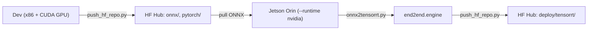

# Deployment guide

This document covers how to export trained models to ONNX and deploy them as highly optimized TensorRT engines on Jetson devices.

See [mlops.md](mlops.md) for the broader model lifecycle context.

---

## Quick reference

```bash
# 1. Export generic segmentation model to ONNX
python tools/export/torch2onnx.py \
  configs/deploy/custom/segmentation_onnxruntime_dynamic.py \
  <model_cfg.py> <checkpoint.pth> <sample_image.jpg> \
  --work-dir <output_dir>

# 2. Add ArgMax post-processing to ONNX
python tools/export/onnx_add_argmax_output.py \
  <output_dir>/end2end.onnx <output_dir>/end2end_dual.onnx

# 3. Stage for Hugging Face release
python tools/stage_hf_repo.py \
  --run-dir work_dirs/<exp> --pth <checkpoint.pth> \
  --onnx-dir <output_dir> --repo-name <org>/<model-repo>

# 4. Push to Hugging Face
python tools/push_hf_repo.py --repo-id <org>/<model-repo> --local-dir work_dirs/.hf/<repo-name>
```

---

## End-to-end: Dev → Hub → Jetson → Hub

The full loop walks four hops:



### Step 0 — Authenticate (once per machine)

On **dev** and **Jetson**:
```bash
huggingface-cli login          # or: export HF_TOKEN=hf_...
```
The token needs **write** access to the model repo on both machines.

### Step 1 — On dev: Train, export, stage, release

1. **Train**:
   ```bash
   python tools/train.py configs/train/.../my_model.py --work-dir work_dirs/my_exp
   ```

2. **Export to ONNX**:
   ```bash
   python tools/export/torch2onnx.py \
     configs/deploy/custom/segmentation_onnxruntime_dynamic.py \
     configs/train/.../my_model.py \
     work_dirs/my_exp/best_val_mIoU_iter_25000.pth \
     assets/image/sample.jpg \
     --work-dir work_dirs/my_exp/deploy/onnx
   ```

3. **Append ArgMax Output** (Optional but recommended):
   ```bash
   python tools/export/onnx_add_argmax_output.py \
     work_dirs/my_exp/deploy/onnx/end2end.onnx \
     work_dirs/my_exp/deploy/onnx/end2end_dual.onnx
   ```

4. **Stage and Push to Hugging Face**:
   ```bash
   python tools/stage_hf_repo.py \
     --run-dir work_dirs/my_exp \
     --pth best_val_mIoU_iter_25000.pth \
     --onnx-dir work_dirs/my_exp/deploy/onnx \
     --repo-name mts-segformer-mit-b0
     
   python tools/push_hf_repo.py \
     --repo-id <org>/mts-segformer-mit-b0 \
     --local-dir work_dirs/.hf/mts-segformer-mit-b0
   ```

### Step 2 — On Jetson: Pull ONNX, build engine

Use the lean deployment image on your Jetson target:

```bash
docker run --rm -it --runtime nvidia \
  -v "$PWD":/workspace -w /workspace -e PYTHONPATH=/workspace \
  -e HF_TOKEN=$HF_TOKEN \
  mts-deploy-jetson bash
```

Inside the container, build the engine:
```bash
python3 tools/export/onnx2tensorrt.py \
  --onnx work_dirs/.hf/mts-segformer-mit-b0/deploy/onnx/end2end_dual.onnx \
  --output-dir work_dirs/.hf/mts-segformer-mit-b0/deploy/tensorrt \
  --precision fp16
```

### Step 3 — On Jetson: Push engine back to the same Hub repo

```bash
python3 tools/push_hf_repo.py \
  --repo-id <org>/mts-segformer-mit-b0 \
  --local-dir work_dirs/.hf/mts-segformer-mit-b0/deploy/tensorrt
```

---

## Adding new ONNX op rewrites (post-export)

`tools/export/torch2onnx.py` automatically rewrites non-standard mmdeploy/mmcv ops to standard ONNX equivalents so the model runs on plain ONNX Runtime.

Custom op rewrites are registered in:
```
tools/export/helpers/_onnx_rewriter.py
```

Use `register_rewriter` to add new rules:
```python
from tools.export.helpers._onnx_rewriter import register_rewriter

@register_rewriter("mmdeploy", "my_custom_op")
def rewrite_my_op(node):
    # return replacement node(s)
    ...
```

Pass `--no-rewrite` during export to skip post-export rewriting.
